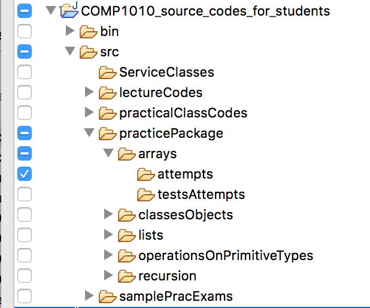

# Department of Computing, Macquarie University
## Workshop - Unit testing

# NOTE

We will continue working with the `COMP1010_source_codes_for_students` project. This week, we are dealing with package `practicalClassCodes.week03`.

# Outline 

1. Test quality
2. Sample mappings
3. Satisfying JUnit tests
4. Writing JUnit tests

# Test quality

When writing tests for a particular method, a set of input-output mappings is used to test the correctness of the method. This set should test as many scenarios as possible.

## Question 1

Consider a method that is supposed to return the number of even digits in an integer. Which of the following sets of sample inputs is the best?

1. 31, 255, 1
2. 240, 1080, 0, 42
3. 31, 65, 84, 29
4. 5782, 374, 18642, -7135342
5. 1, 589, 409512, -6158, 0

## Question 2

Consider a method that returns the number of odd values in an array. If one sample input is `{15, 7, 103}`, does a second sample input `{15, 103, 91}` offer any additional value to the test (as in improving the "test quality")? What about `{81, -25, 63}`?

## Question 3

Consider a method with the following header:

```java
/**
 * return true if there exists any value that occurs 
 * more than once in the array, false otherwise
 */
public static boolean hasDuplicates(int[] data)
```

Write a set of sample inputs and expected outputs to test the correctness of its implementation.

| &nbsp;&nbsp;&nbsp;&nbsp;&nbsp;&nbsp; Passed array &nbsp;&nbsp;&nbsp;&nbsp;&nbsp;&nbsp; | Expected return value |
|--------------|-----------------------|
|  &nbsp;&nbsp;&nbsp;&nbsp;&nbsp;&nbsp;            |                       |
|  &nbsp;&nbsp;&nbsp;&nbsp;&nbsp;&nbsp;            |                       |
|  &nbsp;&nbsp;&nbsp;&nbsp;&nbsp;&nbsp;            |                       |
|  &nbsp;&nbsp;&nbsp;&nbsp;&nbsp;&nbsp;            |                       |
|  &nbsp;&nbsp;&nbsp;&nbsp;&nbsp;&nbsp;            |                       |
|  &nbsp;&nbsp;&nbsp;&nbsp;&nbsp;&nbsp;            |                       |

## Question 4a

Consider a method `sum` that when passed an integer array, returns the sum of all the items in the array.

1. What value is the method **expected** to return for the array \{10, 70, 20, 90\}?

Now, consider the following implementation of this method:

```java
public class Question4a {
	/** 
	 * return the sum of all items of the array passed
	 */
	public static int sum(int[] data) {
		int r = 0;
		for(int i=1; i < data.length; i++) {
			r+=data[i];
		}
		return r;
	}
}
```

2. What value does the above method **actually** return for the array \{10, 70, 20, 90\}?

This check on expectations is managed by the assertion:

```java
int[] arr = {10, 70, 20, 90};
assertEquals(190, Question4a.sum(arr));
```

Here, 190 is the expected value, while `Question4.sum(arr)` is the actual value returned by our implementation.

## Question 4b

Consider the following implementation of a method:

```java
public class Question4b {
	/** 
	 * return number of items in the array that belong 
	 * to the range [min...max]
	 */
	public static int countInRange(int[] data, int min, int max) {
		int r = 0;
		for(int i=0; i < data.length; i++) {
			if(data[i] > min && data[i] < max) {
				r++;
			}
		}
		return r;
	}
}
```

Will the above implementation pass the following test cases and if not, which case will it fail (first)?

```java
@Test
public void testCountInRange() {
	int[] a = {10, 70, 20, 90, 30, 80};
	assertEquals(2, Question4b.countInRange(a, 25, 75));
	assertEquals(3, Question4b.countInRange(a, 15, 75));
	assertEquals(0, Question4b.countInRange(a, -100, -60));
	assertEquals(6, Question4b.countInRange(a, 0, 100));
	assertEquals(1, Question4b.countInRange(a, 85, 95));
}
```

## Question 5

Can you identify the bug in the implementation of `countInRange`? What tests must be added to expose this category of bugs?

## Question 6

Consider the following method header:

```java
public class Question6 {
	/**
	 * return true if the array is in ascending order, false otherwise.
	 * ascending order is where every item is less than or equal to the 
	 * the item after it.
	 */
	public static boolean isAscending(int[] data) {
		return false; //to be completed
	}
}
```

Complete the test to check the correctness of the implementation of `isAscending`. Two test cases are provided to get you started.

```java
public void testIsAscending() {
	int[] a = {10, 20, 30, 40};
	assertTrue(Question6.isAscending(a));
	
	int[] b = {40, 30, 20, 10};
	assertFalse(Question6.isAscending(b));
	
	//add more test cases
	
	
	
	
	
	
	
}
```

## Question 7

Consider the following method header:

```java
public class Question7 {
	/**
	 * return the first index at which target exists in the array.
	 * return -1 if target does not exist in the array
	 */
	public static int indexOf(int[] data, int target) {
		return 0; //to be completed
	}
}
```

Complete the test to check the correctness of the implementation of `indexOf`.

```java
@Test
public void testIndexOf() {
	//add test cases


	
	
	
	
	
	
	
}
```

## Question 8

Work on the practice package for **arrays** for the rest of the time. It's in `practicePackage.arrays.attempts`, corresponding tests under `practicePackage.arrays.testsAttempts`. There are four stages, going from easier to harder. 

### You must complete -

1. at least 30 methods overall, and,
2. at least 10 methods from stage 2, and,
3. at least 2 method from stage 3.

Make the submission as an exported archive file (select ONLY package `practicePackage.arrays.attempts` under the `src` folder, NOT the `bin` folder) named `studentID.zip` (where studentID is your Student ID) on iLearn under "Week 3 submission" by **Sunday 15th March, 21:00**.

